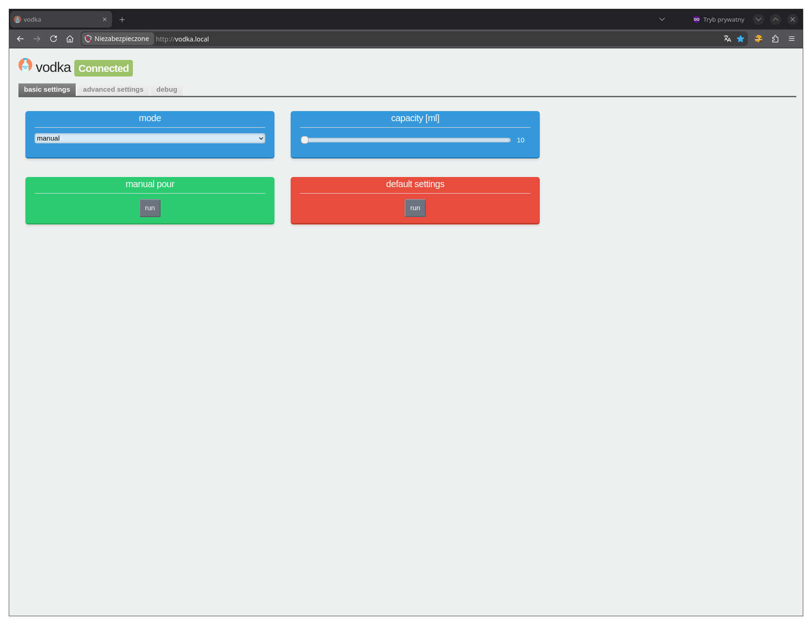
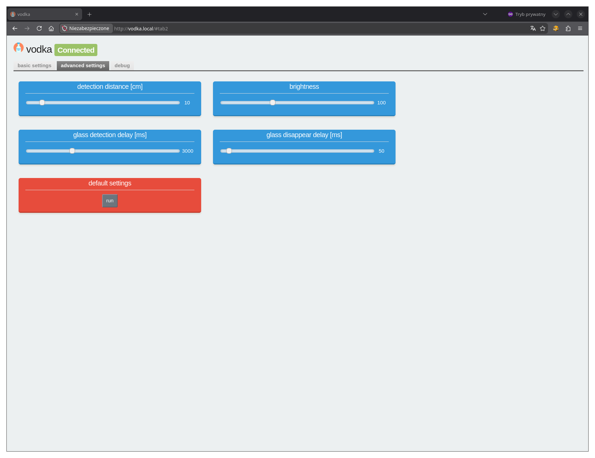
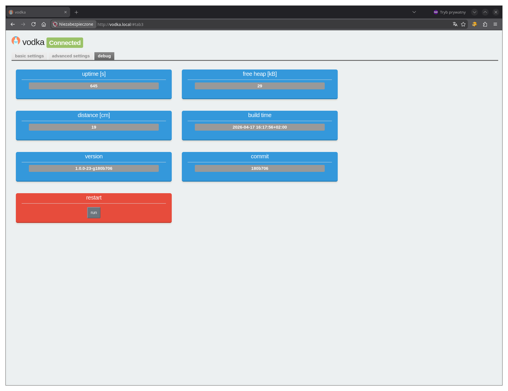
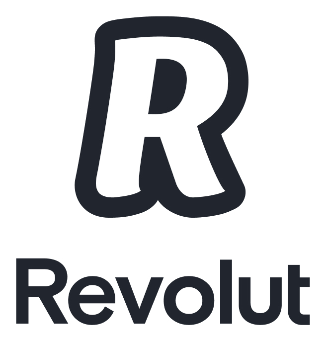
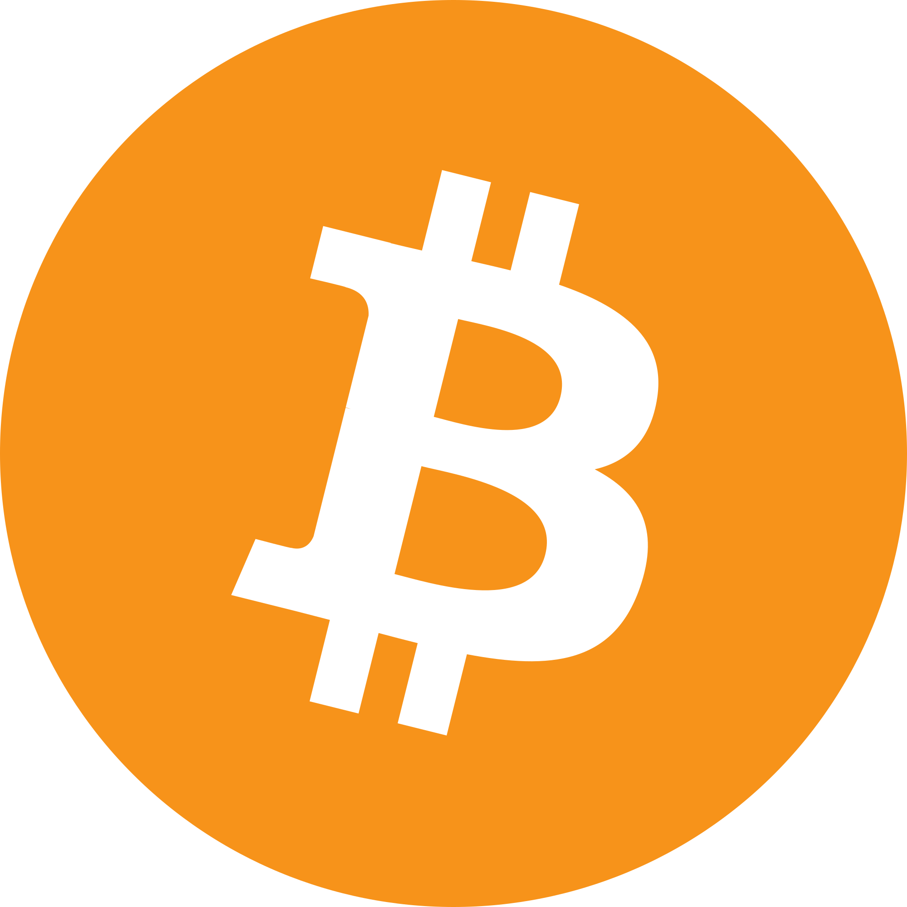

# Introduction

The project is to build a device for automatically pouring vodka into glasses that move on wooden toy tracks.

# Presentation video

[](http://www.youtube.com/watch?v=X1K5z6y2sik "Video")

# Quickstart

## 3D files

Parts to print available [here](3d/).

## Needed hardware

- `ESP8266` board with Li-Ion 18650
- `SSD1306` OLED 0.96" `I2C` 128x64
- `VL53L0X` time of flight distance sensor `I2C`
- 5 V relay module
- 5 V mini pump
- 5 V `WS2812` 12 led circle
- voltage divider between battery and A0
- silicone tube

## Pinout

| Description | ESP8266 PIN | ESP8266 PIN label |
| ----------- | ----------- | ----------------- |
| I2C SCL     | GPIO5       | D1                |
| I2C SDA     | GPIO4       | D2                |
| Relay       | GPIO12      | D5                |
| WS2812      | GPIO14      | D5                |
| Battery +   | GPIO17      | A0                |

## Flash

```
platformio run -t buildfs
platformio run -t uploadfs
platformio run -t upload
```

## Settings

Connect your mobile phone or PC to WiFi:  
network name: `Vodka`  
password: `12345678`

Then open [http://vodka.local/](http://vodka.local/).

|                   |                   |                   |
| ----------------- | ----------------- | ----------------- |
|  |  |  |
 
# Contributing

In general don't be afraid to send pull request. Use the "fork-and-pull" Git workflow.

1. **Fork** the repo
2. **Clone** the project to your own machine
3. **Commit** changes to your own branch
4. **Push** your work back up to your fork
5. Submit a **Pull request** so that we can review your changes

NOTE: Be sure to merge the **latest** from **upstream** before making a pull request!

# Donations

If you enjoy this project and want to thanks, please use follow link:

[](https://www.paypal.com/donate/?hosted_button_id=6JQ963AU688QN)
[](https://revolut.me/borysm2b)


BTC address: 18UDYg9mu26K2E3U479eMvMZXPDpswR7Jn

# License

[](https://www.gnu.org/licenses/gpl.html)

- *[GPLv3 license](https://www.gnu.org/licenses/gpl.html)*
